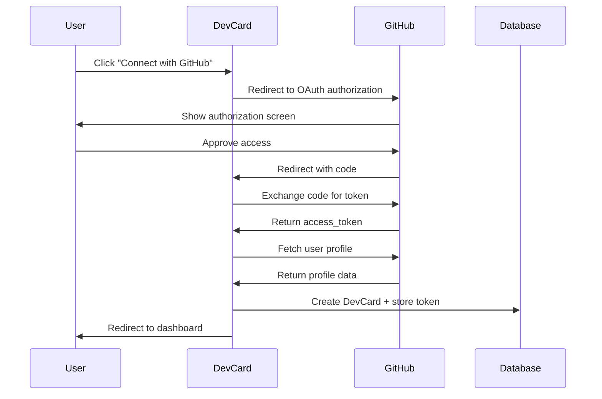

# GitHub Integration Patterns

**Feature**: DevCard V2 - Developer Social Business Card Platform
**Date**: 2025-11-11

## Overview

This document defines the integration patterns for GitHub OAuth authentication, API data fetching, caching strategies, and webhook handling for DevCard V2.

## 1. GitHub OAuth Flow

### Authentication Sequence



### OAuth Configuration

```typescript
// src/auth.ts
import GitHubProvider from "next-auth/providers/github";

providers: [
  GitHubProvider({
    clientId: process.env.GITHUB_ID!,
    clientSecret: process.env.GITHUB_SECRET!,
    authorization: {
      params: {
        scope: 'read:user user:email public_repo'
      }
    }
  })
]
```

### Required Scopes

| Scope | Purpose | Justification |
|-------|---------|---------------|
| `read:user` | Read user profile data | Required for name, bio, avatar, location |
| `user:email` | Read email address | Required for user account creation |
| `public_repo` | Read public repositories | Required for repo stats and featured repos |

### Environment Variables

```env
GITHUB_ID=your_client_id
GITHUB_SECRET=your_client_secret
GITHUB_WEBHOOK_SECRET=your_webhook_secret
```

### OAuth Callbacks

```typescript
// src/auth.ts
callbacks: {
  async signIn({ user, account, profile }) {
    if (account?.provider === 'github') {
      // Store GitHub data
      await db.update(users).set({
        github_id: profile.id,
        github_username: profile.login
      }).where(eq(users.id, user.id));

      // Create DevCard
      await createDevCard({
        user_id: user.id,
        github_username: profile.login,
        github_id: profile.id,
        avatar_url: profile.avatar_url
      });

      // Trigger initial sync
      await triggerGitHubSync(user.id);
    }
    return true;
  },

  async session({ session, user }) {
    session.user.id = user.id;
    session.user.github_username = user.github_username;
    return session;
  }
}
```

## 2. GitHub API Client Configuration

### Octokit Client Setup

```typescript
// lib/github/client.ts
import { Octokit } from '@octokit/rest';
import { throttling } from '@octokit/plugin-throttling';
import { db } from '@/db';
import { accounts } from '@/db/schema/user';
import { eq, and } from 'drizzle-orm';

const ThrottledOctokit = Octokit.plugin(throttling);

export async function getGitHubClient(userId: string): Promise<Octokit> {
  // Get access token from database
  const account = await db.query.accounts.findFirst({
    where: and(
      eq(accounts.userId, userId),
      eq(accounts.provider, 'github')
    )
  });

  if (!account?.access_token) {
    throw new Error('GitHub not connected');
  }

  return new ThrottledOctokit({
    auth: account.access_token,
    throttle: {
      onRateLimit: (retryAfter, options, octokit, retryCount) => {
        console.warn(
          `Rate limit hit for ${options.method} ${options.url}, ` +
          `retrying after ${retryAfter} seconds (attempt ${retryCount})`
        );
        return retryCount < 3; // Retry up to 3 times
      },
      onSecondaryRateLimit: (retryAfter, options, octokit) => {
        console.warn(
          `Secondary rate limit hit for ${options.method} ${options.url}`
        );
        return true; // Always retry on secondary limits
      }
    },
    request: {
      timeout: 10000 // 10 second timeout
    }
  });
}
```

### Rate Limit Monitoring

```typescript
// lib/github/rate-limits.ts
export async function checkRateLimits(octokit: Octokit) {
  const { data } = await octokit.rateLimit.get();

  return {
    core: {
      limit: data.rate.limit,
      remaining: data.rate.remaining,
      reset: new Date(data.rate.reset * 1000)
    },
    search: {
      limit: data.resources.search.limit,
      remaining: data.resources.search.remaining,
      reset: new Date(data.resources.search.reset * 1000)
    }
  };
}
```

## 3. Data Fetching Patterns

### Profile Data

```typescript
// lib/github/fetch-profile.ts
export async function fetchGitHubProfile(userId: string) {
  const octokit = await getGitHubClient(userId);

  const { data: profile } = await octokit.users.getAuthenticated();

  return {
    login: profile.login,
    name: profile.name,
    bio: profile.bio,
    location: profile.location,
    email: profile.email,
    avatar_url: profile.avatar_url,
    html_url: profile.html_url,
    public_repos: profile.public_repos,
    public_gists: profile.public_gists,
    followers: profile.followers,
    following: profile.following,
    created_at: profile.created_at,
    updated_at: profile.updated_at
  };
}
```

### Repository Data

```typescript
// lib/github/fetch-repos.ts
export async function fetchGitHubRepos(userId: string, options?: {
  sort?: 'stars' | 'updated' | 'created';
  limit?: number;
}) {
  const octokit = await getGitHubClient(userId);
  const { sort = 'stars', limit = 30 } = options || {};

  // Fetch user's repositories
  const { data: repos } = await octokit.repos.listForAuthenticatedUser({
    sort: sort === 'stars' ? 'updated' : sort,
    direction: 'desc',
    per_page: 100 // Fetch max, filter client-side
  });

  // Filter out forks (optional)
  const ownRepos = repos.filter(repo => !repo.fork);

  // Sort by stars if requested
  if (sort === 'stars') {
    ownRepos.sort((a, b) => b.stargazers_count - a.stargazers_count);
  }

  // Map to simplified format
  const mappedRepos = ownRepos.slice(0, limit).map(repo => ({
    name: repo.name,
    full_name: repo.full_name,
    description: repo.description,
    html_url: repo.html_url,
    language: repo.language,
    stargazers_count: repo.stargazers_count,
    forks_count: repo.forks_count,
    updated_at: repo.updated_at,
    topics: repo.topics || []
  }));

  return mappedRepos;
}
```

### Contribution Stats

```typescript
// lib/github/calculate-stats.ts
export async function calculateGitHubStats(userId: string) {
  const octokit = await getGitHubClient(userId);
  const username = await getUserGitHubUsername(userId);

  // Fetch repositories for star count
  const repos = await fetchGitHubRepos(userId, { limit: 100 });
  const totalStars = repos.reduce((sum, repo) => sum + repo.stargazers_count, 0);

  // Note: Contribution streak requires GitHub GraphQL API or scraping
  // For now, we'll use a simplified approach
  const contributionStreak = await fetchContributionStreak(octokit, username);

  return {
    total_stars: totalStars,
    contribution_streak: contributionStreak.current,
    longest_streak: contributionStreak.longest
  };
}

async function fetchContributionStreak(octokit: Octokit, username: string) {
  // Option 1: Use GitHub GraphQL API (preferred)
  // Option 2: Use third-party API (github-contributions-api)
  // Option 3: Calculate from events API (limited history)

  // For MVP, return placeholder
  // TODO: Implement GraphQL query
  return {
    current: 0,
    longest: 0
  };
}
```

## 4. Caching Strategy

### Cache Layers

```typescript
// lib/github/cache.ts
import { kv } from '@vercel/kv';
import { db } from '@/db';
import { github_cache } from '@/db/schema/github-cache';

const CACHE_TTL = {
  profile: 86400,  // 24 hours
  repos: 3600,     // 1 hour
  stats: 3600      // 1 hour
};

export async function getCachedProfile(username: string) {
  // Try Redis cache first
  const cached = await kv.get(`github:profile:${username}`);
  if (cached) return cached;

  // Fall back to database
  const dbCache = await db.query.github_cache.findFirst({
    where: eq(github_cache.login, username)
  });

  if (dbCache && new Date(dbCache.expires_at) > new Date()) {
    // Update Redis from DB
    await kv.setex(
      `github:profile:${username}`,
      CACHE_TTL.profile,
      JSON.stringify(dbCache)
    );
    return dbCache;
  }

  return null;
}

export async function setCachedProfile(username: string, data: any) {
  const expiresAt = new Date(Date.now() + CACHE_TTL.profile * 1000);

  // Store in Redis
  await kv.setex(
    `github:profile:${username}`,
    CACHE_TTL.profile,
    JSON.stringify(data)
  );

  // Store in database as backup
  await db.insert(github_cache).values({
    login: username,
    ...data,
    cached_at: new Date(),
    expires_at: expiresAt
  }).onConflictDoUpdate({
    target: github_cache.login,
    set: {
      ...data,
      cached_at: new Date(),
      expires_at: expiresAt
    }
  });
}

export async function invalidateCache(username: string) {
  // Clear Redis
  await kv.del(`github:profile:${username}`);
  await kv.del(`github:repos:${username}`);
  await kv.del(`github:stats:${username}`);

  // Update database expiration
  await db.update(github_cache)
    .set({ expires_at: new Date() })
    .where(eq(github_cache.login, username));
}
```

### Cache Invalidation Triggers

1. **Manual refresh** - User clicks "Sync GitHub Data"
2. **Scheduled job** - Daily background sync via Inngest
3. **Webhook event** - GitHub repository push/star events
4. **Cache expiration** - TTL-based automatic expiration

## 5. Background Sync Jobs

### Inngest Sync Function

```typescript
// lib/inngest/functions/sync-github-data.ts
import { inngest } from '../client';

export const syncGitHubData = inngest.createFunction(
  { id: 'sync-github-data' },
  { event: 'github/sync.requested' },
  async ({ event, step }) => {
    const { userId } = event.data;

    // Step 1: Fetch profile
    const profile = await step.run('fetch-profile', async () => {
      return await fetchGitHubProfile(userId);
    });

    // Step 2: Fetch repositories
    const repos = await step.run('fetch-repos', async () => {
      return await fetchGitHubRepos(userId);
    });

    // Step 3: Calculate stats
    const stats = await step.run('calculate-stats', async () => {
      return await calculateGitHubStats(userId);
    });

    // Step 4: Update cache
    await step.run('update-cache', async () => {
      await setCachedProfile(profile.login, {
        ...profile,
        repositories: repos,
        ...stats
      });
    });

    // Step 5: Update DevCard
    await step.run('update-devcard', async () => {
      await db.update(devcards)
        .set({ last_github_sync: new Date() })
        .where(eq(devcards.user_id, userId));
    });

    return { success: true, profile, repos, stats };
  }
);

// Daily auto-sync for all users
export const dailyGitHubSync = inngest.createFunction(
  { id: 'daily-github-sync' },
  { cron: '0 2 * * *' }, // 2 AM UTC
  async ({ step }) => {
    const users = await step.run('get-active-users', async () => {
      return await db.query.devcards.findMany({
        where: eq(devcards.is_public, true),
        limit: 1000 // Batch limit
      });
    });

    // Sync in batches
    for (const user of users) {
      await inngest.send({
        name: 'github/sync.requested',
        data: { userId: user.user_id }
      });

      // Rate limit: 50ms between requests
      await step.sleep('rate-limit', 50);
    }

    return { synced: users.length };
  }
);
```

## 6. Webhook Integration (Optional)

### GitHub Webhook Handler

```typescript
// app/api/webhooks/github/route.ts
import { NextRequest, NextResponse } from 'next/server';
import crypto from 'crypto';

export async function POST(request: NextRequest) {
  const signature = request.headers.get('x-hub-signature-256');
  const body = await request.text();

  // Verify webhook signature
  if (!verifyWebhookSignature(body, signature)) {
    return NextResponse.json({ error: 'Invalid signature' }, { status: 401 });
  }

  const event = JSON.parse(body);
  const eventType = request.headers.get('x-github-event');

  switch (eventType) {
    case 'push':
      await handlePushEvent(event);
      break;
    case 'star':
      await handleStarEvent(event);
      break;
    case 'repository':
      await handleRepositoryEvent(event);
      break;
  }

  return NextResponse.json({ received: true });
}

function verifyWebhookSignature(body: string, signature: string | null): boolean {
  if (!signature) return false;

  const hmac = crypto.createHmac('sha256', process.env.GITHUB_WEBHOOK_SECRET!);
  const digest = `sha256=${hmac.update(body).digest('hex')}`;

  return crypto.timingSafeEqual(
    Buffer.from(signature),
    Buffer.from(digest)
  );
}

async function handlePushEvent(event: any) {
  const username = event.repository.owner.login;
  await invalidateCache(username);
  await inngest.send({
    name: 'github/sync.requested',
    data: { username }
  });
}
```

## 7. Error Handling

### Error Types

```typescript
export class GitHubAPIError extends Error {
  constructor(
    message: string,
    public status: number,
    public code?: string
  ) {
    super(message);
    this.name = 'GitHubAPIError';
  }
}

export class RateLimitError extends GitHubAPIError {
  constructor(
    public resetAt: Date
  ) {
    super('GitHub API rate limit exceeded', 429, 'RATE_LIMIT');
  }
}

export class TokenExpiredError extends GitHubAPIError {
  constructor() {
    super('GitHub access token expired', 401, 'TOKEN_EXPIRED');
  }
}
```

### Error Recovery

```typescript
export async function fetchWithRetry<T>(
  fn: () => Promise<T>,
  options?: {
    maxRetries?: number;
    backoff?: number;
  }
): Promise<T> {
  const { maxRetries = 3, backoff = 1000 } = options || {};

  for (let i = 0; i < maxRetries; i++) {
    try {
      return await fn();
    } catch (error) {
      if (error instanceof RateLimitError) {
        // Wait until rate limit resets
        const waitMs = error.resetAt.getTime() - Date.now();
        await new Promise(resolve => setTimeout(resolve, waitMs));
        continue;
      }

      if (i === maxRetries - 1) throw error;

      // Exponential backoff
      await new Promise(resolve => setTimeout(resolve, backoff * Math.pow(2, i)));
    }
  }

  throw new Error('Max retries exceeded');
}
```

## 8. Testing Patterns

### Mock GitHub API Responses

```typescript
// tests/mocks/github.ts
export const mockGitHubProfile = {
  login: 'testuser',
  name: 'Test User',
  bio: 'Test developer',
  location: 'San Francisco',
  email: 'test@example.com',
  avatar_url: 'https://avatars.githubusercontent.com/u/12345',
  public_repos: 25,
  followers: 100,
  following: 50
};

export const mockGitHubRepos = [
  {
    name: 'awesome-project',
    full_name: 'testuser/awesome-project',
    description: 'An awesome project',
    html_url: 'https://github.com/testuser/awesome-project',
    language: 'TypeScript',
    stargazers_count: 150,
    forks_count: 20,
    updated_at: '2025-01-01T00:00:00Z',
    topics: ['typescript', 'nextjs']
  }
];
```

## Summary

### Integration Checklist

- [x] GitHub OAuth configuration
- [x] Octokit client with throttling
- [x] Profile data fetching
- [x] Repository data fetching
- [x] Stats calculation
- [x] Redis + Database caching
- [x] Cache invalidation strategy
- [x] Background sync jobs (Inngest)
- [x] Webhook handling (optional)
- [x] Error handling & retry logic
- [x] Rate limit monitoring

### Security Considerations

1. **Token Storage**: Encrypted in database, never exposed to client
2. **Webhook Verification**: HMAC signature validation
3. **Rate Limiting**: Application-level rate limiting + Octokit throttling
4. **Minimal Scopes**: Only request necessary GitHub permissions
5. **Token Rotation**: Handle token expiration gracefully

### Performance Optimizations

1. **Aggressive Caching**: 24-hour TTL for profile data
2. **Background Jobs**: Non-blocking sync operations
3. **Batch Operations**: Sync users in controlled batches
4. **Edge Caching**: Cache public DevCards at CDN edge
5. **Database Indexes**: Optimized queries for lookups

## Next Steps

1. ✅ GitHub integration patterns defined
2. ⏭️ Generate quickstart.md
3. ⏭️ Update agent context
4. ⏭️ Generate tasks.md
