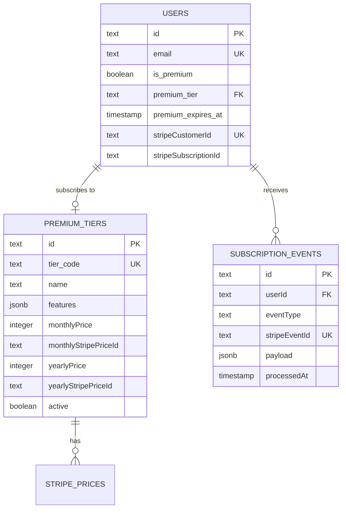
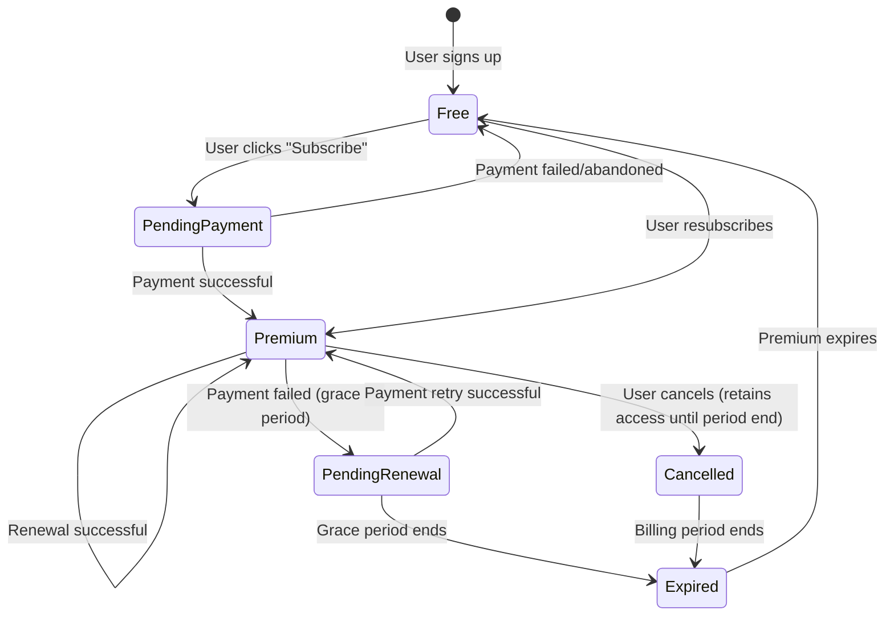
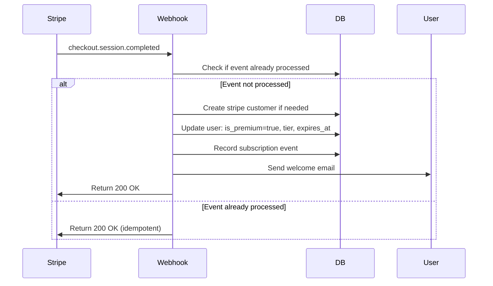

# Data Model: StackPass Premium Membership System

**Feature**: 005-premium-stripe
**Date**: 2025-11-23
**Purpose**: Define database schema, entities, relationships, and migration strategy for the premium membership system

## Entity Overview



## Core Entities

### 1. Users Table (Existing - Updated)

**Table Name**: `app_user`

**Purpose**: Stores user account information including premium subscription status

**Schema Changes**:

```typescript
// NEW FIELD (add)
premium_tier: text | null
  // Maps to premium_tiers.tier_code
  // Examples: 'premium', 'premium_pro'
  // NULL = free user

// EXISTING FIELDS (keep)
is_premium: boolean (default: false)
  // Quick access flag for premium status
  // Updated by webhook on subscription events

premium_expires_at: timestamp | null
  // Subscription expiry date
  // NULL = never expires OR not premium
  // Checked on every premium access attempt

stripeCustomerId: text | null
  // Stripe customer ID (starts with 'cus_')
  // Created on first subscription
  // Used for Stripe Customer Portal access

stripeSubscriptionId: text | null
  // Active Stripe subscription ID (starts with 'sub_')
  // NULL = no active subscription
  // Updated on subscription created/cancelled events

// FIELD TO REMOVE (migration)
planId: text | null
  // Legacy plan management field
  // Will be dropped after migration
```

**Indexes**:
```sql
CREATE INDEX idx_users_premium_expires
ON app_user(premium_expires_at)
WHERE is_premium = true;

CREATE INDEX idx_users_premium_tier
ON app_user(premium_tier)
WHERE premium_tier IS NOT NULL;

CREATE INDEX idx_users_stripe_customer
ON app_user(stripeCustomerId)
WHERE stripeCustomerId IS NOT NULL;
```

**Constraints**:
```sql
-- Premium users must have an expiry date
ALTER TABLE app_user
ADD CONSTRAINT chk_premium_requires_expiry
CHECK (
  (is_premium = false) OR
  (is_premium = true AND premium_expires_at IS NOT NULL)
);

-- Premium users must have a tier
ALTER TABLE app_user
ADD CONSTRAINT chk_premium_requires_tier
CHECK (
  (is_premium = false) OR
  (is_premium = true AND premium_tier IS NOT NULL)
);
```

### 2. Premium Tiers Table (Existing - Repurposed)

**Table Name**: `plans` (repurposed from legacy plan management)

**Purpose**: Store premium tier configuration, pricing, features, and Stripe price ID mappings

**Schema Changes**:

```typescript
// NEW FIELDS (add)
tier_code: text | null
  // Unique identifier for tier (e.g., 'premium', 'premium_pro')
  // Maps to users.premium_tier
  // NULL = not a premium tier (legacy plan)

active: boolean (default: true)
  // Controls tier visibility on pricing page
  // Allows soft-delete of tiers

// EXISTING FIELDS (repurpose)
id: text (UUID primary key)
name: text
  // Display name (e.g., "Premium", "Premium Pro")

features: jsonb
  // Feature list for this tier
  // Example: {
  //   "custom_themes": true,
  //   "advanced_analytics": true,
  //   "priority_support": true,
  //   "max_projects": 100
  // }

monthlyPrice: integer
  // Price in cents (e.g., 900 = $9.00)

monthlyStripePriceId: text
  // Stripe price ID for monthly billing
  // Example: "price_1234567890abcdef"

yearlyPrice: integer
  // Price in cents (e.g., 9000 = $90.00)

yearlyStripePriceId: text
  // Stripe price ID for annual billing

// FIELDS TO REMOVE (migration)
quotas: jsonb
  // Legacy quota system
  // No longer needed with premium-only model

hasOnetimePricing: boolean
onetimePrice: integer
onetimeStripePriceId: text
  // One-time payment not supported in premium model

monthlyPriceAnchor: integer
yearlyPriceAnchor: integer
  // Anchor pricing no longer needed

codename: text
  // Used for credit allocation, may be kept if credit system continues
```

**Indexes**:
```sql
CREATE UNIQUE INDEX idx_plans_tier_code
ON plans(tier_code)
WHERE tier_code IS NOT NULL;

CREATE INDEX idx_plans_active
ON plans(active, tier_code)
WHERE tier_code IS NOT NULL;
```

**Sample Data**:
```sql
INSERT INTO plans (id, tier_code, name, features, hasYearlyPricing, yearlyPrice, yearlyStripePriceId, active) VALUES
  (
    gen_random_uuid(),
    'premium',
    'Premium',
    '{"custom_themes": true, "advanced_analytics": true, "priority_support": true, "custom_domain": true, "organization_profiles": true}',
    true,
    4900,  -- $49/year
    'price_premium_annual',
    true
  );
```

**Note**: StackPass uses a simple pricing model - Free or Premium ($49/year, annual billing only).

### 3. Subscription Events Table (New)

**Table Name**: `subscription_events`

**Purpose**: Audit log of all Stripe webhook events for debugging, compliance, and idempotency

**Schema**:

```typescript
{
  id: text (UUID primary key)
  userId: text (foreign key → users.id)
    // User affected by this event
    // NULL for events not tied to specific user

  stripeEventId: text (unique)
    // Stripe event ID (e.g., "evt_1234567890abcdef")
    // Used for idempotency (prevent duplicate processing)

  eventType: text
    // Stripe event type (e.g., "checkout.session.completed")

  payload: jsonb
    // Full Stripe event payload
    // Useful for debugging and audit trail

  processedAt: timestamp (default: now())
    // When the event was successfully processed

  processingStatus: text (enum: 'pending', 'success', 'failed')
    // Tracks webhook processing state

  errorMessage: text | null
    // Error details if processing failed
}
```

**Indexes**:
```sql
CREATE UNIQUE INDEX idx_subscription_events_stripe_id
ON subscription_events(stripeEventId);

CREATE INDEX idx_subscription_events_user
ON subscription_events(userId, processedAt DESC);

CREATE INDEX idx_subscription_events_type
ON subscription_events(eventType, processedAt DESC);
```

**Idempotency Pattern**:
```typescript
// Check if event already processed
const existing = await db
  .select()
  .from(subscriptionEvents)
  .where(eq(subscriptionEvents.stripeEventId, event.id))
  .limit(1);

if (existing.length > 0) {
  // Event already processed, return success
  return new Response(JSON.stringify({ received: true }), { status: 200 });
}

// Process event...

// Record event
await db.insert(subscriptionEvents).values({
  id: generateId(),
  userId: user.id,
  stripeEventId: event.id,
  eventType: event.type,
  payload: event,
  processingStatus: 'success'
});
```

## Supporting Entities

### 4. Credit Transactions (Existing - Unchanged)

**Table Name**: `credit_transactions`

**Purpose**: Track credit allocations, debits, and expiry

**No Changes Required**: Credit system continues to operate independently of premium system

**Note**: Credit allocation on plan change will need to be updated to use `premium_tier` instead of `planId`

### 5. Email Notifications (Conceptual)

**Note**: Email notifications are not stored in the database. They are sent via Resend and tracked in Resend's dashboard.

**Email Types**:
- **PremiumWelcomeEmail**: Sent on first subscription
- **PremiumReminderEmail**: Sent at 7, 3, 1 day before expiry
- **PaymentFailedEmail**: Sent when invoice payment fails
- **SubscriptionCancelledEmail**: Sent when user cancels

**Email Tracking** (Optional Future Enhancement):
```typescript
// If email tracking is needed in the future
{
  id: text (UUID)
  userId: text (FK)
  emailType: text (enum)
  sentAt: timestamp
  resendId: text (Resend message ID)
  status: text (enum: 'sent', 'delivered', 'bounced', 'complained')
}
```

## Database Migration Strategy

### Phase 1: Add New Fields (Non-Breaking)

```sql
-- Add premium_tier field to users
ALTER TABLE app_user
ADD COLUMN premium_tier text REFERENCES plans(tier_code);

-- Add tier_code and active fields to plans
ALTER TABLE plans
ADD COLUMN tier_code text UNIQUE,
ADD COLUMN active boolean DEFAULT true;

-- Create subscription_events table
CREATE TABLE subscription_events (
  id text PRIMARY KEY,
  user_id text REFERENCES app_user(id) ON DELETE CASCADE,
  stripe_event_id text UNIQUE NOT NULL,
  event_type text NOT NULL,
  payload jsonb NOT NULL,
  processed_at timestamp DEFAULT now(),
  processing_status text DEFAULT 'success',
  error_message text
);

-- Create indexes
CREATE INDEX idx_users_premium_expires ON app_user(premium_expires_at) WHERE is_premium = true;
CREATE INDEX idx_users_premium_tier ON app_user(premium_tier) WHERE premium_tier IS NOT NULL;
CREATE UNIQUE INDEX idx_plans_tier_code ON plans(tier_code) WHERE tier_code IS NOT NULL;
CREATE UNIQUE INDEX idx_subscription_events_stripe_id ON subscription_events(stripe_event_id);
```

### Phase 2: Data Migration

```sql
-- Backfill premium users with tier codes
-- (Manual step - requires mapping existing premium users to tiers)
UPDATE app_user
SET premium_tier = 'premium'
WHERE is_premium = true AND premium_tier IS NULL;

-- Update plans table with tier codes
UPDATE plans
SET tier_code = 'premium', active = true
WHERE name = 'Premium';

UPDATE plans
SET tier_code = 'premium_pro', active = true
WHERE name = 'Premium Pro';

-- Mark non-premium plans as inactive
UPDATE plans
SET active = false
WHERE tier_code IS NULL;
```

### Phase 3: Add Constraints (After Data Migration)

```sql
-- Ensure premium users have expiry dates
ALTER TABLE app_user
ADD CONSTRAINT chk_premium_requires_expiry
CHECK (
  (is_premium = false) OR
  (is_premium = true AND premium_expires_at IS NOT NULL)
);

-- Ensure premium users have tiers
ALTER TABLE app_user
ADD CONSTRAINT chk_premium_requires_tier
CHECK (
  (is_premium = false) OR
  (is_premium = true AND premium_tier IS NOT NULL)
);
```

### Phase 4: Remove Legacy Fields (Breaking - Final Step)

```sql
-- Drop planId foreign key and column
ALTER TABLE app_user
DROP CONSTRAINT IF EXISTS app_user_planId_fkey,
DROP COLUMN planId;

-- Drop legacy fields from plans
ALTER TABLE plans
DROP COLUMN quotas,
DROP COLUMN hasOnetimePricing,
DROP COLUMN onetimePrice,
DROP COLUMN onetimeStripePriceId,
DROP COLUMN monthlyPriceAnchor,
DROP COLUMN yearlyPriceAnchor;

-- Drop legacy payment provider fields (optional)
ALTER TABLE app_user
DROP COLUMN lemonSqueezyCustomerId,
DROP COLUMN lemonSqueezySubscriptionId,
DROP COLUMN dodoCustomerId,
DROP COLUMN dodoSubscriptionId;

-- Drop PayPal context table (if exists)
DROP TABLE IF EXISTS paypal_context;
```

### Rollback Plan

```sql
-- If migration fails, rollback by:
1. Restore planId column
2. Remove tier_code column
3. Drop subscription_events table
4. Restore from database backup
```

## Entity Relationships

### User → Premium Tier

```typescript
interface User {
  id: string;
  email: string;
  is_premium: boolean;
  premium_tier: string | null; // FK to plans.tier_code
  premium_expires_at: Date | null;
}

interface PremiumTier {
  id: string;
  tier_code: string; // Referenced by users.premium_tier
  name: string;
  features: Record<string, boolean>;
  monthlyPrice: number;
  monthlyStripePriceId: string;
  yearlyPrice: number;
  yearlyStripePriceId: string;
  active: boolean;
}

// Relationship: One user can have zero or one premium tier
// One premium tier can have many users
```

### User → Subscription Events

```typescript
interface SubscriptionEvent {
  id: string;
  userId: string; // FK to users.id
  stripeEventId: string; // Unique
  eventType: string;
  payload: object;
  processedAt: Date;
  processingStatus: 'pending' | 'success' | 'failed';
  errorMessage: string | null;
}

// Relationship: One user can have many subscription events
// One subscription event belongs to one user
```

### Stripe → Database Mapping

```typescript
// Stripe Customer → User
Stripe Customer ID (cus_xxx) = users.stripeCustomerId

// Stripe Subscription → User
Stripe Subscription ID (sub_xxx) = users.stripeSubscriptionId

// Stripe Price → Premium Tier
Stripe Price ID (price_xxx) = plans.monthlyStripePriceId or yearlyStripePriceId

// Stripe Event → Subscription Event
Stripe Event ID (evt_xxx) = subscription_events.stripeEventId
```

## Validation Rules

### User Premium Status Validation

```typescript
export function validatePremiumStatus(user: User): void {
  // If premium, must have expiry date
  if (user.is_premium && !user.premium_expires_at) {
    throw new Error('Premium user must have expiry date');
  }

  // If premium, must have tier
  if (user.is_premium && !user.premium_tier) {
    throw new Error('Premium user must have tier code');
  }

  // Expiry date must be in the future
  if (user.is_premium && new Date(user.premium_expires_at) < new Date()) {
    throw new Error('Premium expiry date must be in the future');
  }

  // If has tier, tier must exist in plans table
  if (user.premium_tier) {
    // Validate tier_code exists in plans table
  }
}
```

### Premium Tier Validation

```typescript
export function validatePremiumTier(tier: PremiumTier): void {
  // Tier code must be lowercase alphanumeric + underscores
  if (!/^[a-z0-9_]+$/.test(tier.tier_code)) {
    throw new Error('Invalid tier code format');
  }

  // Must have both monthly and annual pricing
  if (!tier.monthlyPrice || !tier.yearlyPrice) {
    throw new Error('Tier must have both monthly and annual pricing');
  }

  // Must have Stripe price IDs
  if (!tier.monthlyStripePriceId || !tier.yearlyStripePriceId) {
    throw new Error('Tier must have Stripe price IDs');
  }

  // Features must be valid JSON object
  if (typeof tier.features !== 'object') {
    throw new Error('Features must be a JSON object');
  }
}
```

## State Transitions

### User Premium Status State Machine



### Webhook Event Flow



## Query Patterns

### Fetch Active Premium Tiers

```typescript
export async function getActivePremiumTiers() {
  return await db
    .select()
    .from(plans)
    .where(and(
      eq(plans.active, true),
      isNotNull(plans.tier_code)
    ))
    .orderBy(plans.monthlyPrice);
}
```

### Check User Premium Access

```typescript
export async function checkUserPremiumAccess(userId: string) {
  const user = await db
    .select({
      is_premium: users.is_premium,
      premium_tier: users.premium_tier,
      premium_expires_at: users.premium_expires_at
    })
    .from(users)
    .where(eq(users.id, userId))
    .limit(1);

  if (!user.is_premium) return { hasAccess: false };

  const now = new Date();
  const expiresAt = new Date(user.premium_expires_at);

  if (now > expiresAt) {
    // Expired - revoke access
    await revokePremiumAccess(userId);
    return { hasAccess: false, expired: true };
  }

  return {
    hasAccess: true,
    tier: user.premium_tier,
    expiresAt: user.premium_expires_at
  };
}
```

### Find Expiring Subscriptions

```typescript
export async function findExpiringSubscriptions(daysUntilExpiry: number) {
  const targetDate = new Date();
  targetDate.setDate(targetDate.getDate() + daysUntilExpiry);

  // Find subscriptions expiring exactly N days from now
  const startOfDay = new Date(targetDate.setHours(0, 0, 0, 0));
  const endOfDay = new Date(targetDate.setHours(23, 59, 59, 999));

  return await db
    .select()
    .from(users)
    .where(and(
      eq(users.is_premium, true),
      gte(users.premium_expires_at, startOfDay),
      lte(users.premium_expires_at, endOfDay)
    ));
}
```

---

## Conclusion

The data model for the premium membership system is designed to:

1. **Simplify** the existing dual-payment architecture into a premium-only model
2. **Maintain** backward compatibility during migration phase
3. **Enable** dynamic pricing through database-driven tier configuration
4. **Ensure** data integrity through constraints and validation
5. **Support** audit trails through subscription events logging
6. **Scale** efficiently through appropriate indexing

**Next Steps**: Generate API contracts and quickstart documentation (remaining Phase 1 tasks)
